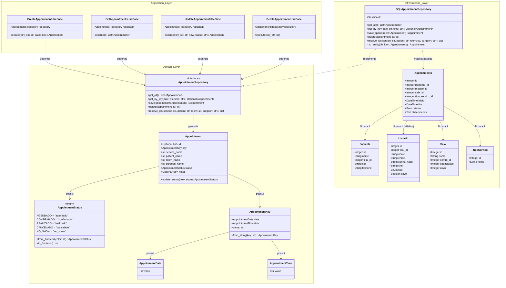

# 📊 Diagrama UML — Agenda Quick

Este documento apresenta a modelagem de classes (UML) do projeto **Agenda Quick**, demonstrando a divisão de responsabilidades conforme a **Clean Architecture** (Arquitetura Limpa), dividida entre **Domain (Domínio)**, **Application (Aplicação)** e **Infrastructure (Infraestrutura)**.

## Detalhes de Arquitetura

1. **Inversão de Dependência (D do SOLID)**: Os casos de uso (`CreateAppointmentUseCase`, etc.) dependem exclusivamente da abstração `AppointmentRepository` (definida na camada de **Domain**), e não da implementação de banco de dados (`SQLAppointmentRepository`).
2. **Separação de Modelos**: A entidade de domínio `Appointment` é separada do modelo persistido no banco de dados (`Agendamento`). A conversão ocorre de forma isolada dentro do método privado `_to_entity` do repositório da infraestrutura.
3. **Imutabilidade**: Chaves e dados de data/hora (`AppointmentKey`, `AppointmentDate`, `AppointmentTime`) são representados como objetos de valor (`value objects`) congelados (`frozen=True`) para evitar modificações indesejadas no fluxo da aplicação.
